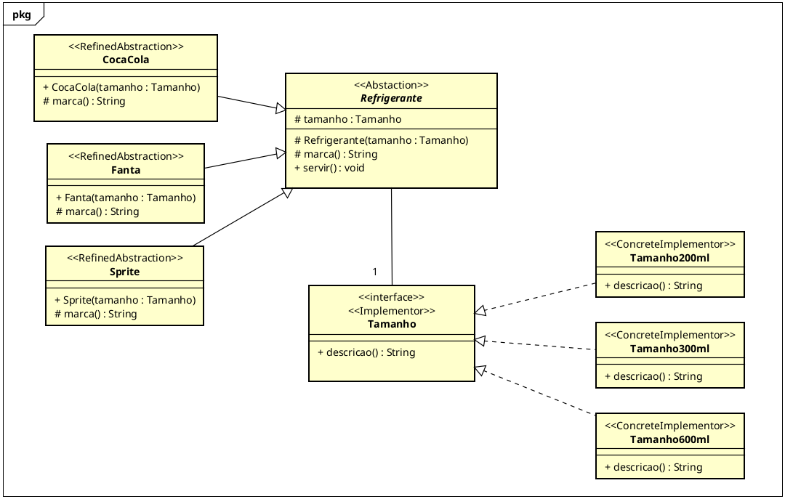

# Etapa 1 — Diagrama UML

O diagrama com os papéis do padrão Bridge:

- `Refrigerante`: Abstraction;
- `CocaCola`, `Fanta` e `Sprite`: RefinedAbstraction;
- `Tamanho`: Implementor;
- `Tamanho200ml`, `Tamanho300ml` e `Tamanho600ml`: ConcreteImplementor.

Objetivo foi representar os refrigerante e separar marcas dos tamanhos, para modularizar e não evitar de ter que criar uma classe pra cada combinação.

## Próxima etapa

A primeira implementação e revisão crítica estão em
[v2-p1 — implementação e revisão crítica](https://github.com/Thalisson-Souza/APSOO-bridge/tree/v2-p1).
